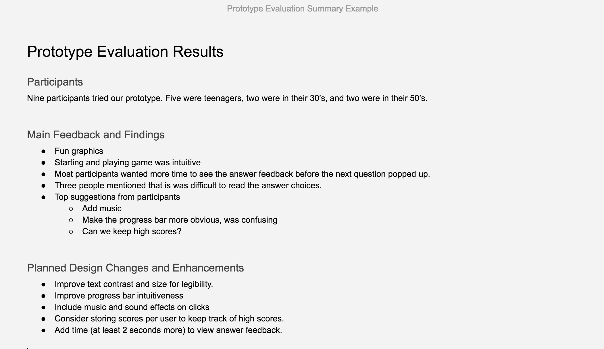
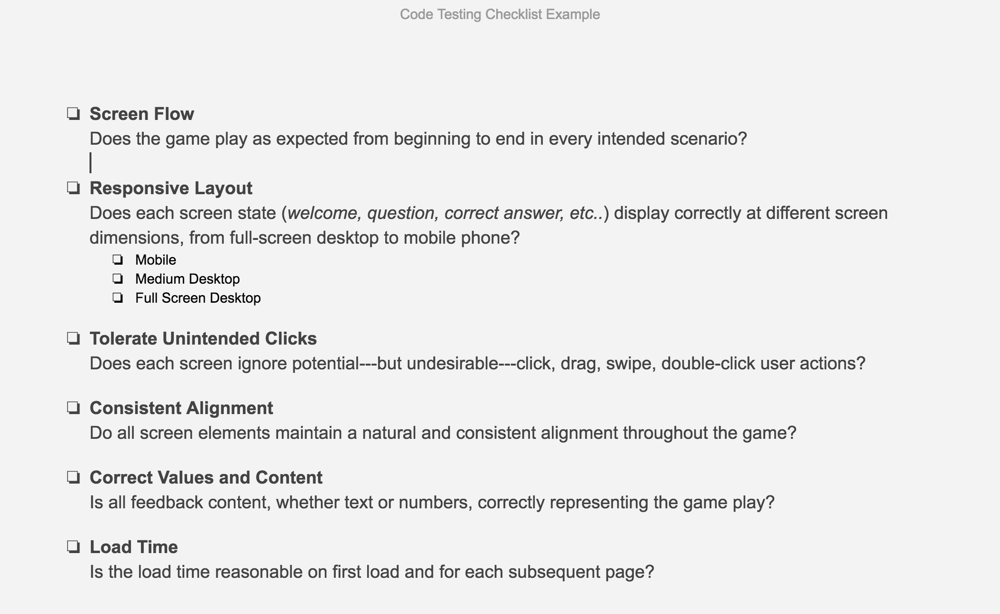

# Examples\*

## 2. Examples for Design & Build Solution

### 2.1 Question Database Development

### 2.2 Interface Mockups

### 2.3 Interactive Prototype

{% embed data="{\"url\":\"https://marvelapp.com/179a1d9g\",\"type\":\"video\",\"title\":\"Photon Trivia Example\",\"description\":\"Marvel Prototype for Photon Trivia Example\",\"thumbnail\":{\"type\":\"thumbnail\",\"url\":\"https://marvel-live.freetls.fastly.net/serve/2018/6/964816145bbc4d878b7bc5a0daa2bc0e.png?quality=95&fake=.png\",\"width\":750,\"height\":1334,\"aspectRatio\":1.7786666666666666},\"embed\":{\"type\":\"player\",\"url\":\"https://marvelapp.com/179a1d9g?emb=1&\",\"html\":\"

<iframe src=\\\"https://marvelapp.com/179a1d9g?emb=1&amp;\\\" style=\\\"border: 0; top: 0; left: 0; width: 100%; height: 100%; position: absolute;\\\" allowfullscreen scrolling=\\\"no\\\"></iframe>

\",\"aspectRatio\":0.4886}}" %}

### 2.4 Prototype Evaluation

### 2.5 Code Development Outline

### 2.6 Marketing Card

### 2.7 Code Testing

