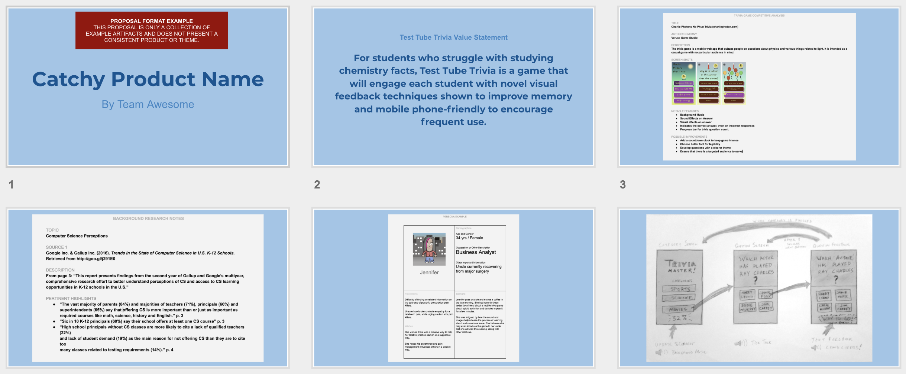

# PROPOSAL PRESENTATION



Refine your previous work as needed to be included in your [**proposal**](https://docs.idew.org/principles-and-practices/practices/design-practices/concept-proposals) presentation. Ensure that each slide contributes to an explanation of a cohesive story that supports your initial concept and value proposition.

[_**7 TIPS FOR PROPOSALS, PITCHES AND PRESENTATIONS**_](https://www.americanexpress.com/us/small-business/openforum/articles/7-tips-for-proposals-pitches-and-presentations/)​

**❏ Deliverable**  
Your team's proposal as a collection of slides containing...

* a title slide
* your value proposition
* summary slides \(or exemplars\) of your team's work - likely not everything though.
  * competitive analyses
  * stakeholder personas
  * storyboard sketches.







| ✓-  Below Standard | ✓  At Standard | ✓+  Above Standard |
| :--- | :--- | :--- |
| **Information** presented in a way that is not always clear, concise, and logical. The presentation style and selection of material  is not fully appropriate for the context. | Information presented in a clear, concise, and logical manner. The selection of material and style is appropriate and effective. | Exceptionally curated information that is delivered in an interesting, coherent and memorable way. |
| **Delivery**: Eye contact, poise, and appropriate voice-level often lacking. | Vocal clarity, eye-contact, and physical composure maintained throughout. | An exceptionally engaging delivery of content lacking unnecessary distractions from the content. |



