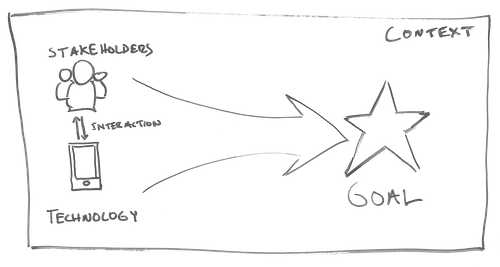

# 1 Discover & Define Problem




In this phase you well begin to frame the **goals** of your team's design by learning about these important aspects.

* **stakeholders in your community**
* **technology available to you and features of existing trivia designs**
* **context of health issues in your community**. 

After conducting research, you will develop initial design ideas and compose a **clear value proposition** that defines _what your team will create, for whom, and the value it will bring_**.** Finally, you will present a proposal to your class and the community for feedback, helping you refine your design direction moving into the next project phase.



**1.1 Trivia Code Tutorial**  
Each team member will complete the exercises in [**the code tutorial**](https://docs.idew.org/code-trivia/build-tutorial) to develop a firm understanding of the technical opportunities and constraints your team will have with your design.  
**❏ Deliverable: Demonstrate that you have completed the build tutorial and can discuss how the code works.**

**1.2 Competitive Analysis**  
Each team member will contribute one [**competitive analysis**](https://docs.idew.org/principles-and-practices/practices/competitive-analysis) of an existing trivia game that is either available on the Web or as an app. Even though you are not investigating direct competition, you will find the analyses valuable in discovering good ideas that you may incorporate into your team's solution. Keep the context of your game in mind, because this may influence what features are appropriate for a game focused on a health issue.  
**❏ Deliverable: Collect your team's competitive analyses into a single document or slide set**.

**1.3 Background Research**  
Each team member will conduct [**background research**](https://docs.idew.org/principles-and-practices/practices/background-research) on at least one health issue to understand the scope of each problem \(like trends, statistics, and causal relationships\) and the opportunities to affect public awareness. It is important to look at each health issue through the lens of public awareness, since your trivia game can address that, rather than brainstorming cures or new treatment plans etc.  How knowledgeable is the general public on the topic right now? How much could the community benefit from learning some key information through a trivia game? What is the potential for generating some social movement? Will you have access to the communities greatly affected by the health issue for further research and testing your trivia app? As a team, discuss all the research and determine which health issue will be your focus. If your team is still undecided, you may use the interviews in the next task to help you finalize your decision.  
**❏ Deliverable: Collect your team's background research into a single document or slide set**.

**1.4 Personas**  
Each team member will conduct two [**interviews**](https://docs.idew.org/principles-and-practices/practices/interviews) of people outside of class to understand their perspective on your chosen health issue and on trivia games. You will want to investigate the depth of each person's knowledge and passion about your health issue. You will also want to gather their likes and dislikes with trivia games and mobile gaming in general. As a team review your interview responses and use this information to develop [**personas**](https://docs.idew.org/principles-and-practices/practices/personas), one for each team member, that describe the context, needs, and frustrations of stakeholders, revealing opportunities to support meaningful change on your health issue.  
**❏ Deliverable: Collect your team's personas into a single document or slide set.**

**1.5 Interaction Storyboard Sketches**  
Each team member will create a unique [**interaction storyboard**](https://docs.idew.org/principles-and-practices/practices/interaction-storyboards) concept based on your understanding about the stakeholders, the trivia code, and a health topic. Each concept \(interaction storyboard sketch\) should contain four screen sketches that represent the welcome screen, question screen, correct answer feedback, and incorrect answer feedback.  
**❏ Deliverable: Collect your team's storyboard sketches into a single document or slide set**.

**1.6 Value Proposition**  
As a team, review all of your work and discuss several possible design directions before settling in on one single [**value proposition**](https://docs.idew.org/principles-and-practices/practices/design-practices/value-proposition). You will want this statement to be clear, concise, and compelling. It should be supported by your research and analysis up to this point.  
**❏ Deliverable: A single page document or slide with your team's value proposition in large font.**

**1.7 Team Proposal**  
Refine your previous work as needed to be included in your [**proposal**](https://docs.idew.org/principles-and-practices/practices/concept-proposals). Ensure that each item contributes to a cohesive story and be prepared to discuss your team's work and ideas in more detail.  
**❏ Deliverable: Your team's proposal as a collection of slides containing your value proposition, competitive analyses, stakeholder personas, and storyboard sketches.**



| _Use the examples below only as general guides on format and content. They are general examples and usually do not directly relate to the problem or context your team is addressing, but they provide useful patterns for you to consider._ |
| --- |

### 1.1 Trivia Code Tutorial

   See the [tutorial](https://docs.idew.org/code-trivia/build-tutorial).

### **1.2 Competitive Analysis**

### 1.3 Background Research

### 1.4 Personas

### 1.5 Interaction Storyboard Sketches

### 1.6 Value Proposition

### 1.7 Team Proposal




#### Proposal Content

| ✓-  Below Standard | ✓  At Standard | ✓+  Above Standard |
| :--- | :--- | :--- |
| **Value proposition** is provided but is not clear or does not offer a compelling need for the proposed solution. | Value proposition is clear and supported by the team's research. | Value proposition is especially convincing and generates anticipation to see the rest of the project. The value to stakeholders is compelling. |
| **Competitive analyses** are provided but they reveal limited valuable insight on existing work. | Competitive analyses provide valuable observations about existing work and will contribute to refining the team's solution.  | Competitive analyses demonstrate especially keen insight, recognizing gaps in existing work that the team could offer in their solution. |
| **Stakeholder personas** are provided but lack clarity and offer limited value in understanding the stakeholders. | Stakeholder personas provide thoughtful descriptions of people that will guide the design of a valuable solution. | Stakeholder personas are vivid descriptions that will bring exceptional focus to the team's development work.  |
| **Storyboard sketches** were completed but only brought a vague understanding of the team's initial ideas. | Storyboard sketches were clear and presented concepts that will positively influence upcoming design work. | Storyboard sketches represented exceptionally clear and detailed concepts, that provide continuity with the research and provide great launching points into upcoming design work. |

#### Proposal Presentation

| ✓-  Below Standard | ✓  At Standard | ✓+  Above Standard |
| :--- | :--- | :--- |
| **Information** presented in a way that is not always clear, concise, and logical. The presentation style and selection of material  is not fully appropriate for the context. | Information presented in a clear, concise, and logical manner. The selection of material and style is appropriate and effective. | Exceptionally curated information that is delivered in an interesting, coherent and memorable way. |
| **Delivery**: Eye contact, poise, and appropriate voice-level often lacking. | Vocal clarity, eye-contact, and physical composure maintained throughout. | An exceptionally engaging delivery of content lacking unnecessary distractions from the content. |



