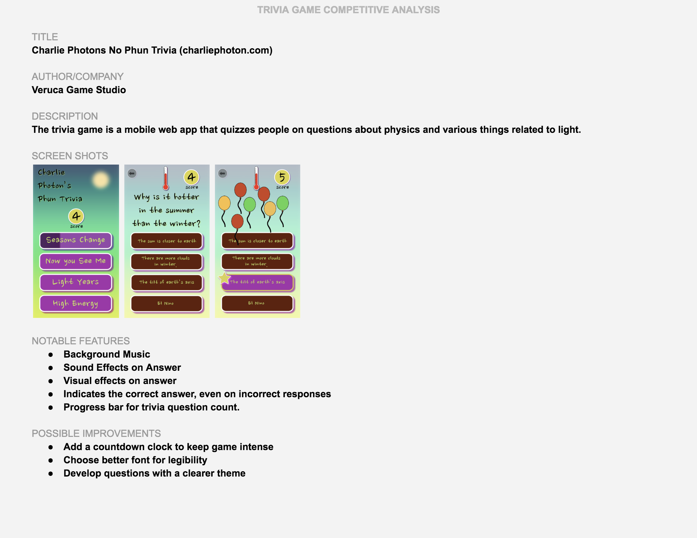

# 1.2 Competitive Analysis



Each team member will contribute one competitive analysis of an existing trivia game that is either available on the Web or as an app. Even though you are not investigating direct competition, you will find the analyses valuable in discovering good ideas that you may incorporate into your team's solution. Keep the context of your game in mind, because this may influence what features are appropriate for a game focused on a particular topic.

**❏ Deliverable**  
Collect your team's competitive analyses into a single document or slide set.







| ✓-  Below Standard | ✓  At Standard | ✓+  Above Standard |
| :--- | :--- | :--- |
| **Competitive analyses** are provided but they reveal limited valuable insight on existing work. | Competitive analyses provide valuable observations about existing work and will contribute to refining the team's solution.  | Competitive analyses demonstrate especially keen insight, recognizing gaps in existing work that the team could offer in their solution. |



