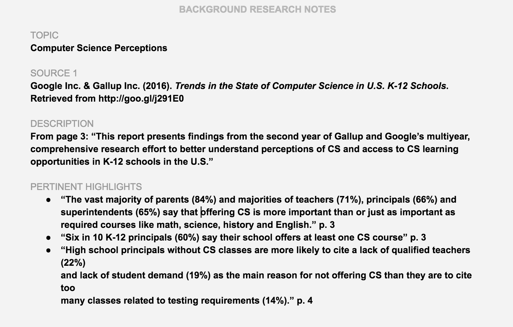

# 1.3 Background Research



Each team member will conduct [**background research**](https://docs.idew.org/principles-and-practices/practices/background-research) on at least one health issue to understand the scope of each problem \(like trends, statistics, and causal relationships\) and the opportunities to affect public awareness. It is important to look at each health issue through the lens of public awareness, since your trivia game can address that, rather than brainstorming cures or new treatment plans etc. How knowledgeable is the general public on the topic right now? How much could the community benefit from learning some key information through a trivia game? What is the potential for generating some social movement? Will you have access to the communities greatly affected by the health issue for further research and testing your trivia app? As a team, discuss all the research and determine which health issue will be your focus. If your team is still undecided, you may use the interviews in the next task to help you finalize your decision.

  
**❏ Deliverable**  
Collect your team's background research into a single document or slide set.  







| ✓-  Below Standard | ✓  At Standard | ✓+  Above Standard |
| :--- | :--- | :--- |



