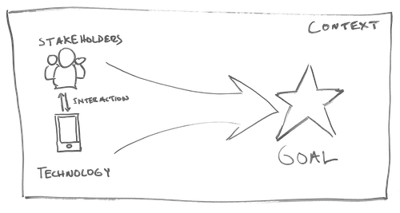

# 1 Discover & Define Problem

In this phase you well begin to **frame the goals** of your team's design by learning about these important aspects.

* **stakeholders in your community**
* **technology available to you and features of existing trivia designs**
* **context of health issues in your community**. 

After conducting research, you will develop initial design ideas and **compose a clear value proposition** that defines _what your team will create, for whom, and the value it will bring_**.** Finally, you will present a proposal to your class and the community for feedback, helping you refine your design direction moving into the next project phase.

