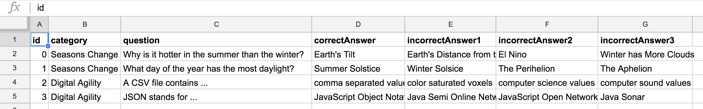
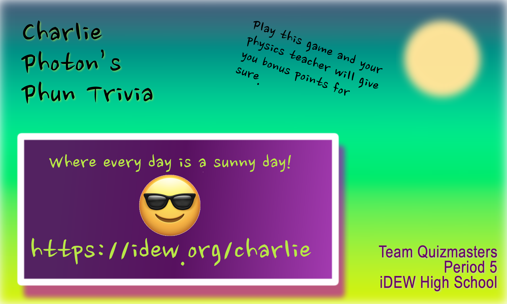

# 2 Design & Build Solution




**Design a prototype** of the solution for a detailed internal review and evaluation by a sample of stakeholders. Based on what you learn from your prototype, organize a development strategy to methodically **program and style your solution** with efficiency and quality. Also prepare for the promotion and launch of your solution. Conduct unit testing to ensure all is in working order before an in-class demonstration.



**2.1 Question Bank Development**  
You will find that creating good trivia questions will take careful thought and multiple iterations. So getting a good start on your question bank will be very beneficial. Follow the [**instructions for managing a question database**](https://docs.idew.org/code-trivia/managing-the-question-db) for your team.  
**❏ Deliverable: Your completed 20+ question database.**

**2.2 Interface Mockups**  
After careful review of your team's sketches and ideas, create digital images that represent examples of your different screen states that can demonstrate the game flow.  
**❏ Deliverable: Five digital screen mockups that represent the welcome screen, the question screen, the question screen on correct answer feedback, the question screen on incorrect answer feedback, and the closing screen once the player is done.**

**2.3 Interactive Prototype**  
Provide enough visual and interactive detail in your prototype to allow thorough testing of each potential user scenario in your game.  
**❏ Deliverable: A link to your working Marvel App prototype that uses your interface mockups.**

**2.4 Prototype Evaluation**  
Each team member should evaluate the prototype by having two people individually play the prototype game using the **think-aloud protocol**. Synthesize your results and define important decisions for your trivia design before coding begins.  
**❏ Deliverable: A document or slide that summarizes the results of your prototype evaluation.**

**2.5 Code Development Outline**  
Outline the features to program by priority--core features, enhanced features, and wish list features. Begin coding and maintain well organized code as you progress towards your first full demonstration.  
**❏ Deliverable: A document or slide that outlines your progressive development plan.**

**2.6 Marketing card**  
Create a 3" x 5" marketing card. The marketing card will be a valuable lead-in to your game that could be distributed physically or as a digital image. Think about what your elevator pitch would be for the game and make it visual.  
**❏ Deliverable: A PNG image file of your marketing card.**

**2.7 Code Testing**  
Conduct some basic code testing to verify that the app is acting as expected under different conditions. Ensure that everything works as expected on different size screens and with touch or mouse interactions. Consider all the things a user might do, like double click, click and drag, swipe, change browser dimensions mid-game, etc.  
**❏ Deliverable: A document outlining the results of your code testing.**

**2.8 Prepare Development Review and Demonstration**  
Take this opportunity to wrap-up your trivia app the best you can in order to begin testing your game in the next phase.  
**❏ Deliverable: A slide set with a link to your prototype, a summary of evaluation results, a copy of your marketing card, and a link to your working trivia app. Prepare to demonstrate and present your work.**



## 2.1 Question Database Development

## 2.2 Interface Mockups

## 2.3 Interactive Prototype

{% embed data="{\"url\":\"https://marvelapp.com/179a1d9g\",\"type\":\"video\",\"title\":\"Photon Trivia Example\",\"description\":\"Marvel Prototype for Photon Trivia Example\",\"thumbnail\":{\"type\":\"thumbnail\",\"url\":\"https://marvel-live.freetls.fastly.net/serve/2018/6/964816145bbc4d878b7bc5a0daa2bc0e.png?quality=95&fake=.png\",\"width\":750,\"height\":1334,\"aspectRatio\":1.7786666666666666},\"embed\":{\"type\":\"player\",\"url\":\"https://marvelapp.com/179a1d9g?emb=1&\",\"html\":\"

<iframe src=\\\"https://marvelapp.com/179a1d9g?emb=1&amp;\\\" style=\\\"border: 0; top: 0; left: 0; width: 100%; height: 100%; position: absolute;\\\" allowfullscreen scrolling=\\\"no\\\"></iframe>

\",\"aspectRatio\":0.4886}}" %}

## 2.4 Prototype Evaluation

## 2.5 Code Development Outline

## 2.6 Marketing Card

## 2.7 Code Testing








