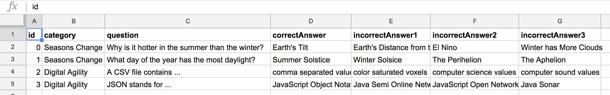

# 2.1 Question Bank Development



You will find that creating good trivia questions will take careful thought and multiple iterations. So getting a good start on your question bank will be very beneficial. Follow the [**instructions for managing a question database**](https://docs.idew.org/code-trivia/code-template/managing-the-question-db) for your team and make an intentional plan to develop your 20 or more questions.

**❏ Deliverable**  
Your completed 20+ question database.







| ✓- Below Standard | ✓ At Standard | ✓+ Above Standard |
| --- | --- |
| **The question bank** is mostly complete but lacks quality of work, revealing a hurried approach or little reflection. | The question bank is complete and presents a consistent method and attention to detail. | The question bank provides exceptionally formed questions and answers that reveal a thoughtful approach to generating and evaluating the quality of the work. |



### 

