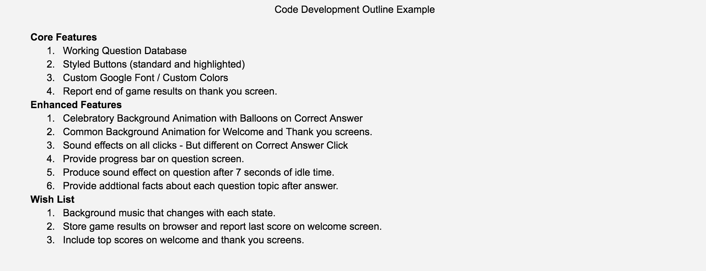

# 2.5 Code Development Outline and Begin Coding



Outline the features to program by priority--core features, enhanced features, and wish list features. This is an example of a basic requirements document. Begin coding and maintain well organized code as you progress towards your first full demonstration.

**❏ Deliverable**  
A document or slide that outlines your progressive development plan.








| ✓- Below Standard | ✓ At Standard | ✓+ Above Standard |
| --- | --- | --- | --- |
| **A prototype** is provided but lacks detail to make the evaluation fruitful, not demonstrating a unique visual or interactive perspective on the basic trivia template design. | A prototype that demonstrates thoughtful concept design and provides a good representation of idea for feedback from participants. | A prototype that is exceptional in representing and evaluating some novel concepts in an efficent way for participants, or a couple variations of a prototype are presented to test alternate concepts. |
| **An evaluation** is presented but doesn't communicate any added value to the team's development process. | An evaluation that produces valuable insights on improving and developing the team's concept. | An evaluation that is exhaustive and thoughtful in collecting as much useful information from participants while be respectful of their time. |
| **A marketing card** is complete but is very basic and lacks cohesion with the overall team's project. | A marketing card conveying a consistent visual and narrative story with the game concept that will clearly generate interest in the game. | A marketing card with an exceptionally engaging and visual message to try the trivia game. |



