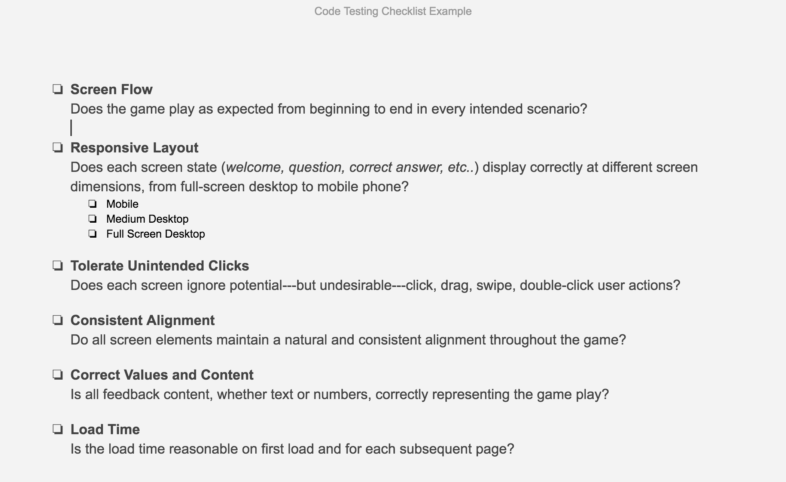

# 2.7 Code Testing



Conduct some basic code testing to verify that the app is acting as expected under different conditions. Ensure that everything works as expected on different size screens and with touch or mouse interactions. Consider all the things a user might do, like double click, click and drag, swipe, change browser dimensions mid-game, etc.

**❏ Deliverable**  
A document outlining the results of your code testing.







| ✓- Below Standard | ✓ At Standard | ✓+ Above Standard |
| --- | --- |
| **The code testing documentation** has been completed but lacks detail or an accurate evaluation of the code quality. | The code testing is complete, accurately represents the state of the application, and is useful in identifying improvements as needed. | The code testing is very thorough and goes beyond the standard testing items provided in the example. |



