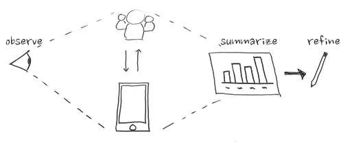

# 3 Evaluate & Refine Solution




After confirmation of the solution’s quality, launch and promote the work. Monitor the use of your solution and gather direct feedback from key stakeholders for minor improvements or recommendations for further development.



**3.1 Evaluation and Post Interview**  
Plan another evaluation to test your live trivia app, including a clear method of record keeping. You will follow up this evaluation with a post interview of participants to investigate the overall effectiveness of your solution in addressing your chose health issue. You want to learn as much as you can while using people's time wisely and respectfully.

**3.2 Evaluation Results and App Refinements**  
It is important to determine how you can get the most return \(improvements in the trivia game\) from the time you have remaining to work. So, based on your evaluation findings, determine a plan to iterate through your changes with frequent testing to ensure nothing is unintentionally broken.

**3.4 Question analysis**  
Prepare summary data and charts on people's responses to your trivia questions and draw some conclusions about the quality of the questions or people's general knowledge about each item.

**3.5 Poster**  
Your poster design is important for two reasons. One, it is an opportunity for your team to reflect on the project process and what you have learned, and two, it provides a great visual aid for explaining your work to visitors at the final event.

**3.6 Prepare for Poster Review and Trivia Demonstration**  
This is a time to develop a clear narrative to share about your team's work and enjoy sharing it with others in class.











## **Submissions for Poster Preview and Trivia App Demonstration**

* Poster
* User Testing Results
* Question Analysis
* Refined Trivia App Code

