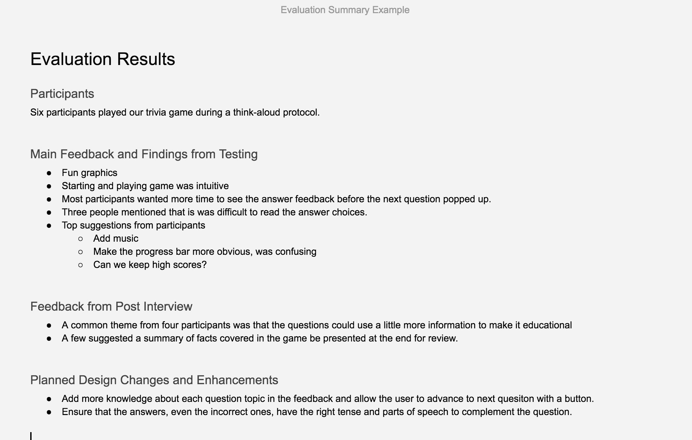

# 3.1 Evaluation and Post Interview



Plan another evaluation to test your live trivia app using the **think-aloud protocol** with at least six people. With your prototype you tested the general game concept, but with this evaluation you want to ensure the game is fully usable and engaging. You also want to evaluate the quality of the trivia questions. Follow up this evaluation with a **post interview** of participants to get feedback on the overall effectiveness of your solution in addressing your chosen health issue. You want to learn as much as you can while using people's time wisely and respectfully.

[_**Thinking Aloud**_ **from Nielsen Norman Group**](https://www.nngroup.com/articles/thinking-aloud-the-1-usability-tool/).

**❏ Deliverable**  
A document or slide that summarizes the results of your evaluation.







| ✓-  Below Standard | ✓  At Standard | ✓+  Above Standard |
| :--- | :--- | :--- |



