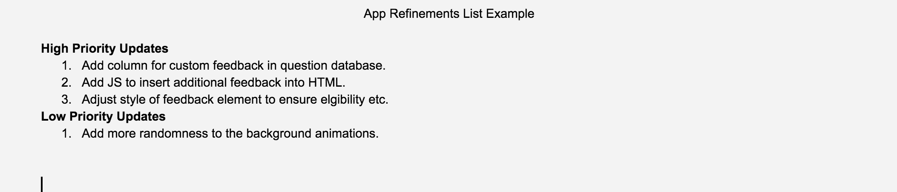

# 3.3 App Refinements



It is important to determine how you can get the most return \(improvements in the trivia game\) from the time you have remaining to work. So, based on your evaluation findings and question analysis, determine a plan to implement improvements while frequently testing to ensure nothing is unintentionally broken. Similar to your code requirements document earlier, simply list items by priority--high priority changes and low priority changes.

**❏ Deliverable**  
A document or slide listing improvements by priority.







#### Final Trivia App \(See [Basic Requirements List for Reference](https://docs.idew.org/project-trivia-health/challenge-and-background#final-deliverables)\)

| ✓-  Below Standard | ✓  At Standard | ✓+  Above Standard |
| :--- | :--- | :--- |
| The application was functional but lacked completeness in presentation or did not meet the criteria set out in the challenge. | The application demonstrated a solutions that was thoughtfully crafted and met all the initial criteria. | The application was clearly the result of exceptional work that provided a highly engaging experience. |



