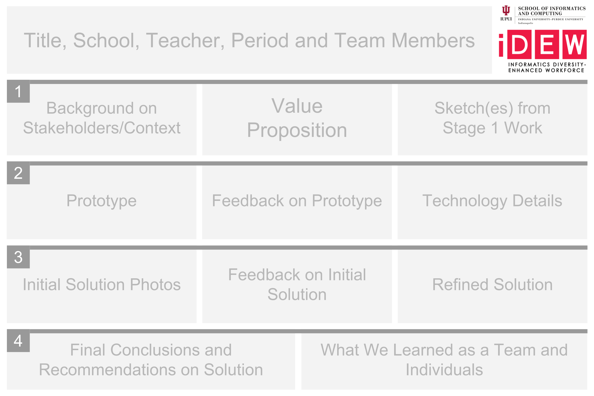

# 3.4 Poster



Your poster design is important for two reasons. One, it is an opportunity for your team to reflect on the project process and what you have learned, and two, it provides a great visual aid for explaining your work to visitors at the final event. Highlight at least six artifacts that demonstrate key work your team completed in the project process from beginning to end, and include a refined value statement that pulls it all together.

**❏ Deliverable**  
A PNG file of poster \(36" x 24"\).







| ✓-  Below Standard | ✓  At Standard | ✓+  Above Standard |
| :--- | :--- | :--- |



