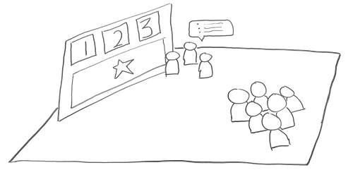

# 4.3 Present to the public




Remember, a lot of people will likely be learning about your project for the first time. You will need to tell your story from the beginning in an engaging way.



#### Final Trivia App \(See [Basic Requirements List for Reference](https://docs.idew.org/project-trivia-health/challenge-and-background#final-deliverables)\)

| ✓-  Below Standard | ✓  At Standard | ✓+  Above Standard |
| :--- | :--- | :--- |
| The application was functional but lacked completeness in presentation or did not meet the criteria set out in the challenge. | The application demonstrated a solutions that was thoughtfully crafted and met all the initial criteria. | The application was clearly the result of exceptional work that provided a highly engaging experience. |

#### Presentation

| ✓-  Below Standard | ✓  At Standard | ✓+  Above Standard |
| :--- | :--- | :--- |
| **Information** presented in a way that is not always clear, concise, and logical. The presentation style and selection of material  is not fully appropriate for the context. | Information presented in a clear, concise, and logical manner. The selection of material and style is appropriate and effective. | Exceptionally curated information that is delivered in an interesting, coherent and memorable way. |
| **Delivery**: Eye contact, poise, and appropriate voice-level often lacking. | Vocal clarity, eye-contact, and physical composure maintained throughout. | An exceptionally engaging delivery of content lacking unnecessary distractions from the content. |



